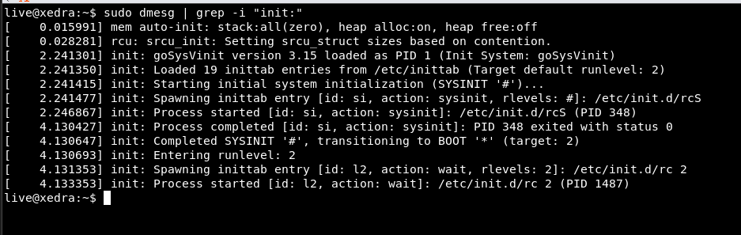

# Validating goSysVinit in Live System

This guide outlines how to verify that **`goSysVinit`** is successfully running as PID 1 on a booted **Xedra Linux** live system.

---

## 1. Verified Live System Boot Log (`dmesg`)

Because `goSysVinit` writes structured boot diagnostics directly to the Linux kernel ring buffer (`/dev/kmsg`), you can inspect the complete initialization lifecycle with `dmesg`:

```bash
sudo dmesg | grep -i "init:"
```

### Live Output:

```text
[  0.015991] mem auto-init: stack:all(zero), heap alloc:on, heap free:off
[  0.028281] rcu: srcu_init: Setting srcu_struct sizes based on contention.
[  2.241301] init: goSysVinit version 3.15 loaded as PID 1 (Init System: goSysVinit)
[  2.241350] init: Loaded 19 inittab entries from /etc/inittab (Target default runlevel: 2)
[  2.241415] init: Starting initial system initialization (SYSINIT '#')...
[  2.241477] init: Spawning inittab entry [id: si, action: sysinit, rlevels: #]: /etc/init.d/rcS
[  2.246867] init: Process started [id: si, action: sysinit]: /etc/init.d/rcS (PID 348)
[  4.130427] init: Process completed [id: si, action: sysinit]: PID 348 exited with status 0
[  4.130647] init: Completed SYSINIT '#', transitioning to BOOT '*' (target: 2)
[  4.130693] init: Entering runlevel: 2
[  4.131353] init: Spawning inittab entry [id: l2, action: wait, rlevels: 2]: /etc/init.d/rc 2
[  4.133353] init: Process started [id: l2, action: wait]: /etc/init.d/rc 2 (PID 1487)
```

### Live Screenshot:



---

## 2. Command-by-Command Verification Reference

### A. Init Version Query
```bash
/sbin/init --version
```
**Expected Output:**
```text
SysV init version: 3.15 (goSysVinit)
```

---

### B. Process & Binary Inspection
```bash
# Verify that PID 1 is executing /sbin/init
ls -l /proc/1/exe
# -> lrwxrwxrwx 1 root root 0 ... /proc/1/exe -> /usr/sbin/init

# Verify PID 1 is a statically compiled Go binary
file /proc/1/exe
# -> ELF 64-bit LSB executable, x86-64, statically linked, Go BuildID=...

# Check PID 1 status in process table
ps -p 1 -o pid,comm,args
# ->   PID COMMAND         COMMAND
# ->     1 init            /sbin/init
```

---

### C. Runlevel Verification
```bash
# Check current runlevel
runlevel
# -> N 2

# Check runlevel state file
cat /var/run/runlevel
# -> 2
```

---

### D. Init Control Channel Test (`telinit`)
```bash
# Request PID 1 to reload inittab
sudo telinit q

# Check dmesg to observe PID 1 handling the request
dmesg | tail -n 10
```
